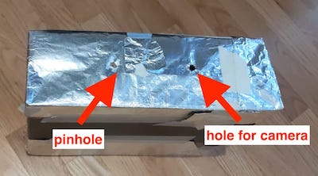
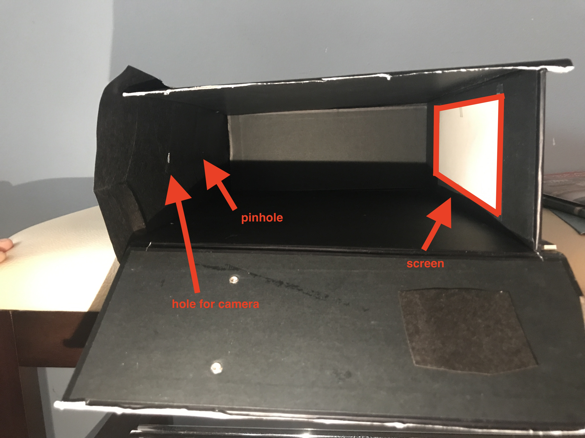
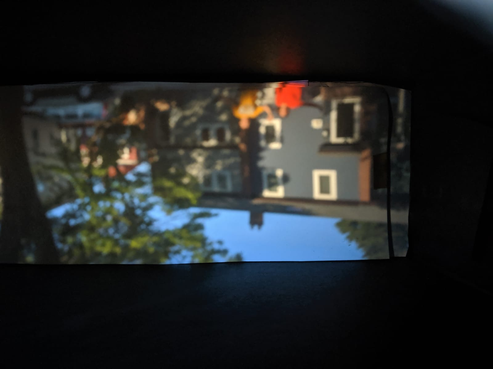
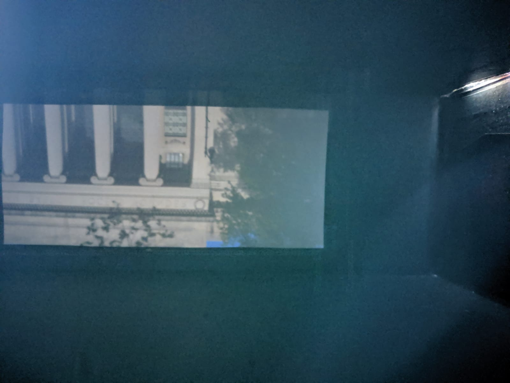
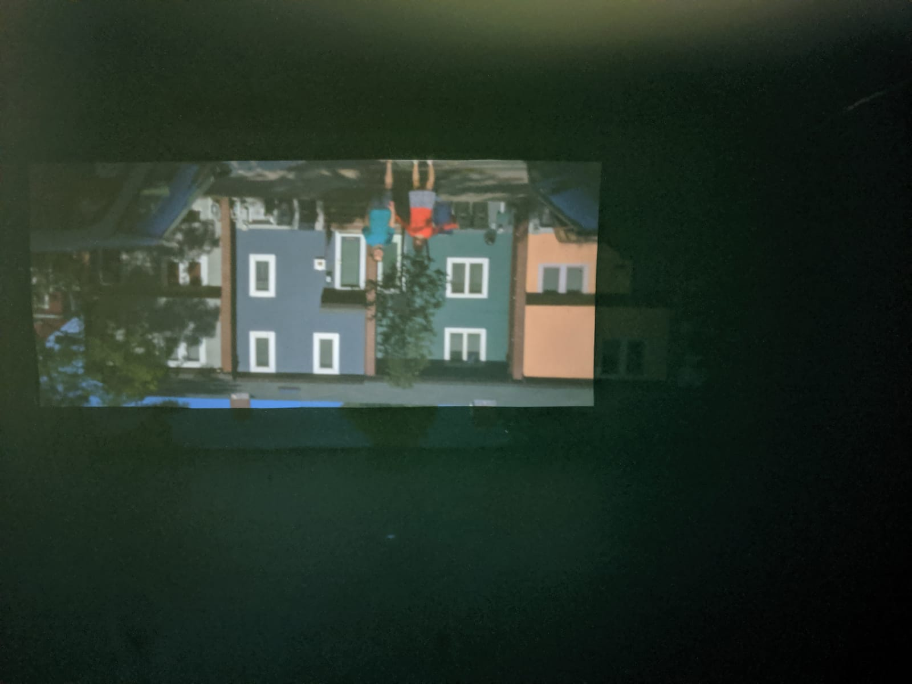

# About

For this project, I worked with my partner Lucie Gillet to build a [camera obscura](https://en.wikipedia.org/wiki/Camera_obscura) from scratch. We worked on this as part of an assignment for MIT 6.869: Advances in Computer Vision (Fall 2019) taught by Professors Bill Freeman, Antonio Torralba, and Philip Isola. Course website [here](http://6.869.csail.mit.edu/fa19/).

# What is a camera obscura?

A camera obscura is a dark chamber with a single, tiny hole (the pinhole) in one side that lets light in. Rays of light from the outside enter the pinhole, and hit the wall opposite the pinhole, forming a projected image:

")

The image is inverted top-bottom and right-left because it is projected through the pinhole. 

The image is projected inside the camera - so how do we see it? Some camera obscuras are built as structures large enough to go inside and look at the projection on a screen. However, in our case we created a small camera from a cardboard box and then used the digital cameras on our phones to capture the projected images. 

# How to build the pinhole camera

Instructions copied from the assignment

- Find a cardboard box.
- Make a tiny hole (~= 5 mm) in the center of one of the faces. This will be your pinhole.
- Make a second hole, just big enough for your camera. If you're using a professional camera, make a hole just wide enough for your lens to fit. If you're using a phone, make a small hole such that you can press your phone to the box, and the camera will not be obstructed. 
- Cover the inside walls with black paper to reduce inter-reflections.
- Place a sheet (or more) of white paper on the wall opposite your pinhole. This white paper will be the screen onto which your image is projected.
- (Optional) You may also want to use dark tape along the edges and corners of your box - where two separate pieces of cardboard meet, there may a small slit, which can let light in! (we ended up wrapping the whole camera in foil to solve this problem)

Here's what our camera looked like from the outside:

And here is a side view of the inside, showing the arrangement of the pinholes and the screen:

# Taking Pictures

Since a camera obscura lets in so little light (to keep the image sharp), we made sure to get as much light as possible by taking our pictures outside, in the daytime, on a sunny day. 

In our first attempt, we learned the camera must remain perfectly still - if it moves at all, the images will be blurry:

After some trial and error, we managed to capture some good quality pictures:

# Conclusion

Making a camera obscura is a fun afternoon project, and you can get surprisingly good results! Make sure to block out all light from entering the box through holes or cracks, and try it out on a sunny day!